# Offline Accessible Multimodal Local Content Retrieval System

An offline-first, cross-platform application for discovering and retrieving information from local documents and images. The project is designed to make personal content easier to search without uploading private files to cloud services, while targeting WCAG 2.1 AA accessibility requirements.

> **Development status:** This is an active eight-week software engineering project. Weeks 1 through 4 are complete, and the Week 5 Flutter and accessibility integration is the next milestone.

## Project Motivation

Local devices often contain information spread across text files, PDFs, office documents, screenshots, and images. Traditional search tools rely heavily on filenames or exact keyword matches, while many semantic-search products require cloud processing.

This project aims to provide:

- Offline processing and storage for local content
- Semantic retrieval across text and images
- A cross-platform user interface
- Accessible keyboard and screen-reader workflows
- Modular, testable, and maintainable components
- Transparent and explainable ranking behavior

## Current Progress

### Week 1 - Completed

- Established the Python 3.11 virtual environment and repository structure
- Created a FastAPI service with a liveness endpoint
- Validated persistent ChromaDB storage and vector queries
- Validated TXT and PDF extraction with Apache Tika and PDFium
- Validated local LiteRT/TensorFlow Lite execution
- Created and built the initial Flutter macOS application
- Added sample local files, test utilities, and Git ignore rules

### Week 2 - Completed

- Defined stable interfaces for file scanning, parsing, and ingestion
- Implemented recursive local file discovery
- Added file metadata collection and SHA-256 duplicate detection
- Implemented TXT and PDF parsers
- Added recoverable batch-ingestion error handling
- Added tests for valid, corrupted, unsupported, duplicate, and permission-restricted files
- Completed the Week 2 file-ingestion foundation and parsing regression suite

### Week 3 - Completed

- Added separate `TEXT_SEMANTIC` and `MULTIMODAL` embedding spaces
- Integrated a local BERT-compatible LiteRT backend for text-to-text retrieval
- Converted and integrated MobileCLIP-S0 text and image LiteRT encoders
- Added BERT WordPiece and MobileCLIP tokenizers
- Added text and image preprocessing with model tensor-contract validation
- Added a unified embedding service with L2 normalization and in-memory caching
- Verified MobileCLIP LiteRT outputs against the official PyTorch checkpoint
- Verified real BERT and MobileCLIP inference on macOS
- Completed 77 backend tests with 96.19% embedding-package coverage
- Documented the implementation in [`docs/week3/README.md`](docs/week3/README.md)

### Week 4 - Completed

- Added persistent cosine-similarity vector storage with ChromaDB
- Isolated text-semantic and multimodal collections by embedding space, model, and modality
- Added document and image indexing coordination
- Added three-channel retrieval for BERT text, MobileCLIP text, and MobileCLIP images
- Added explainable hybrid ranking with keyword, text-semantic, and multimodal scores
- Added deterministic tie-breaking and search-service composition
- Verified persistence with a new ChromaDB store instance
- Completed 37 Week 4 tests with 91.69% retrieval-package coverage
- Completed 114 backend tests with 94.18% combined embedding and retrieval coverage
- Documented the implementation in [`docs/week4/README.md`](docs/week4/README.md)

## Planned Features

- Local folder selection and recursive file discovery
- Parsing for TXT, PDF, DOCX, JPG, and PNG files
- SHA-256-based duplicate detection and incremental indexing
- Offline text embeddings using a TensorFlow Lite BERT-compatible model
- Offline text-to-image retrieval using MobileCLIP-compatible encoders
- Local vector storage and similarity search with ChromaDB
- Explainable hybrid ranking using keyword, text-semantic, and image-semantic scores
- Search filters, indexing status, and recoverable error messages
- Keyboard-only navigation, screen-reader labels, scalable text, and high-contrast presentation
- Production builds for supported desktop platforms

## System Architecture

```mermaid
flowchart LR
    A[Local TXT, PDF, DOCX, JPG and PNG files]
    B[File Scanner]
    C[Metadata and SHA-256 Deduplication]
    D[Parser Registry]
    E[Normalized Documents]
    F[Offline Embedding Engine]
    G[ChromaDB Vector Storage]
    H[Hybrid Retrieval and Ranking]
    I[Local FastAPI Service]
    J[Accessible Flutter UI]

    A --> B
    B --> C
    C --> D
    D --> E
    E --> F
    F --> G
    G --> H
    H --> I
    I --> J
```



The architecture separates file input/output, parsing, embedding, vector storage, retrieval, and presentation. Each parser returns a normalized document model so later embedding and retrieval modules do not depend on individual file formats.

## Technology Stack

| Area | Technology |
| --- | --- |
| Backend service | Python 3.11, FastAPI, Uvicorn |
| Cross-platform UI | Flutter, Dart |
| Document parsing | PDFium through `pypdfium2`, Apache Tika |
| Local inference | LiteRT / TensorFlow Lite |
| Text model | BERT-compatible LiteRT model |
| Multimodal model | MobileCLIP-S0 text and image LiteRT encoders |
| Vector storage | ChromaDB |
| Backend testing | pytest, pytest-cov |
| UI testing | Flutter Test |
| Version control | Git, GitHub |
| Accessibility target | WCAG 2.1 AA |

## File-Format Support

| Format | Status | Intended processing |
| --- | --- | --- |
| TXT | In progress | UTF-8 text extraction |
| PDF | In progress | PDFium text extraction |
| DOCX | Planned | Apache Tika document extraction |
| JPG | Planned | Image metadata and multimodal embedding |
| PNG | Planned | Image metadata and multimodal embedding |

## Repository Structure

```text
offline_local_retrieval/
├── backend/
│   ├── app/
│   │   ├── main.py
│   │   └── services/
│   ├── tests/
│   └── requirements.lock
├── frontend/
│   ├── lib/
│   ├── macos/
│   └── test/
├── docs/
├── evaluation/
├── models/
├── runtime/
├── sample_data/
├── tools/
├── .gitignore
└── README.md
```

`models/` and `runtime/` contain local model and runtime data and are intentionally excluded from Git where appropriate.

## Development Setup

### Prerequisites

- Python 3.11
- Git
- Flutter SDK
- Xcode for macOS desktop development
- Apache Tika

The current development environment has been validated on Apple Silicon macOS. Additional desktop platforms will be validated during the packaging phase.

### 1. Clone the repository

```bash
git clone <repository-url>
cd offline-local-retrieval
```

### 2. Create the Python environment

```bash
python3.11 -m venv .venv
source .venv/bin/activate
python -m pip install --upgrade pip
python -m pip install -r backend/requirements.lock
```

### 3. Run the backend service

```bash
python -m uvicorn app.main:app \
  --app-dir backend \
  --host 127.0.0.1 \
  --port 8765 \
  --reload
```

Verify the service from another terminal:

```bash
curl http://127.0.0.1:8765/health/live
```

Expected response:

```json
{"status":"ok"}
```

### 4. Run the Flutter application

```bash
cd frontend
flutter pub get
flutter run -d macos
```

## Testing

Run the backend test suite from the repository root:

```bash
PYTHONPATH=backend python -m pytest backend/tests -v
```

Run the Week 2 coverage check:

```bash
PYTHONPATH=backend python -m pytest backend/tests -v \
  --cov=app.services \
  --cov-report=term-missing \
  --cov-fail-under=80
```

Run Flutter tests:

```bash
cd frontend
flutter test
```

## Privacy and Accessibility Principles

### Privacy

- User-selected files remain on the local device
- Parsing, embedding, indexing, and retrieval are designed to run offline
- Local vectors and metadata are stored in the local runtime directory
- No cloud upload is required for the main workflow

### Accessibility

The final interface will target WCAG 2.1 AA and include:

- Semantic labels for interactive controls
- Keyboard-only navigation and visible focus states
- VoiceOver and NVDA-compatible announcements
- Dynamic text scaling
- High-contrast colors
- Sufficiently large interactive controls
- Clear and recoverable error messages

## Eight-Week Roadmap

| Week | Focus | Status |
| --- | --- | --- |
| 1 | Requirements, repository setup, and technical validation | Completed |
| 2 | Architecture and file-ingestion foundation | Completed |
| 3 | Offline text and multimodal embedding engine | Completed |
| 4 | ChromaDB integration, hybrid ranking, and retrieval MVP | Completed |
| 5 | Flutter UI and accessibility implementation | Planned |
| 6 | Integration, testing, privacy review, and performance optimization | Planned |
| 7 | Documentation, open-source compliance, and release preparation | Planned |
| 8 | Packaging, final validation, GitHub release, and portfolio delivery | Planned |

## Known Limitations

- The project is not yet production-ready
- Only the macOS development environment has been validated so far
- The current ingestion milestone prioritizes TXT and PDF
- DOCX parsing and OCR-related workflows are not yet implemented
- The retrieval engine is implemented in the backend but is not yet exposed through FastAPI or the Flutter interface
- Hybrid-ranking weights are explicit baseline values and have not yet been tuned with a labeled relevance dataset
- Accessibility validation and clean-environment offline testing are scheduled for later milestones

## License

A project license has not yet been finalized. Apache License 2.0 is planned after the Week 7 dependency and open-source compliance review.

## Author

Junhan Chen
