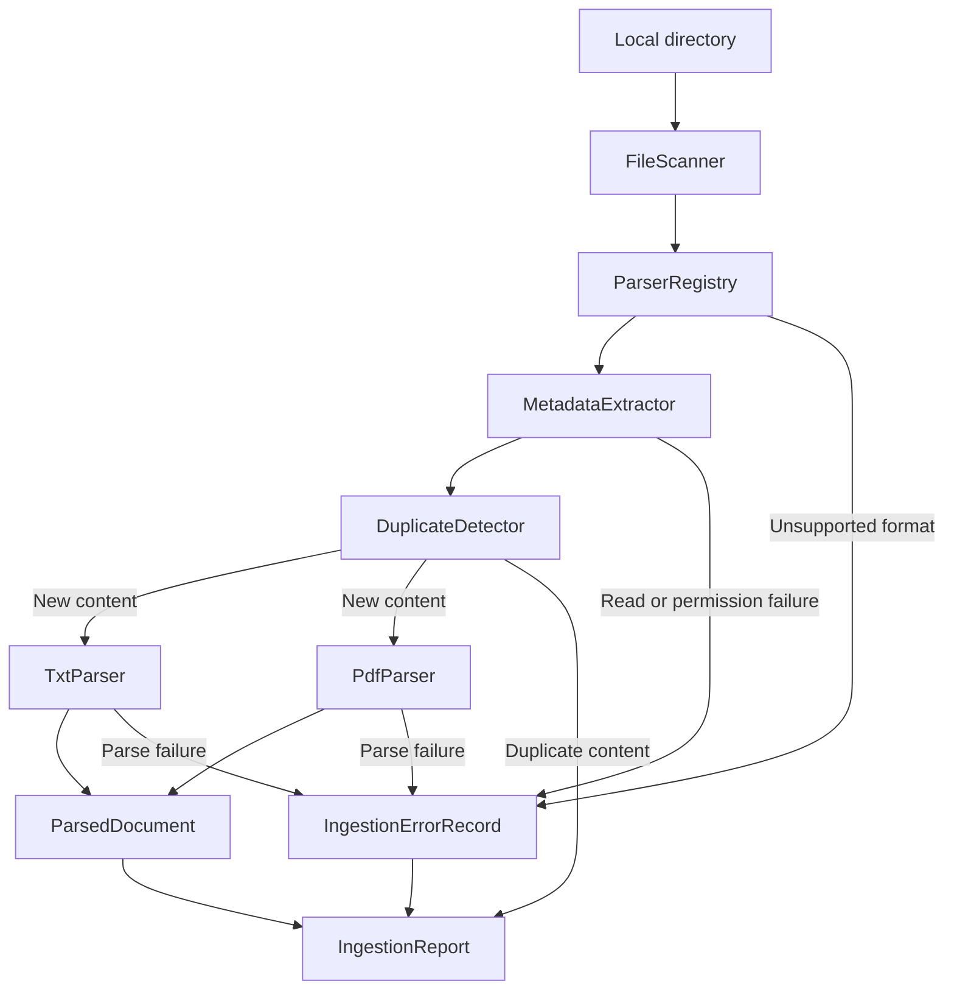

# Week 2 - Architecture and File-Ingestion Foundation

## 1. Objective

Week 2 establishes the architecture and file-ingestion foundation for the Offline Accessible Multimodal Local Content Retrieval System. The implementation separates file discovery, metadata extraction, duplicate detection, parser selection, format-specific parsing, and batch coordination into independently testable components.

This milestone prepares normalized local documents for the offline embedding engine planned for Week 3. It does not perform embedding generation, vector insertion, ranking, or user-interface integration.

## 2. Implemented Scope

The following functionality is complete:

- Recursive discovery of visible regular files
- Exclusion of hidden files, hidden directories, and symbolic links
- File metadata extraction
- SHA-256 content hashing
- Duplicate-content detection within a batch-ingestion run
- Case-insensitive parser selection by file extension
- UTF-8 TXT parsing
- PDF text extraction with PDFium through `pypdfium2`
- Recoverable batch processing that continues after file-level failures
- Structured reporting of parsed documents, duplicates, and errors
- Unit tests for valid, corrupted, unsupported, duplicate, empty-directory, invalid-directory, and permission-error cases

The adjusted Week 2 plan prioritizes TXT and PDF. DOCX, JPG, and PNG support is deferred to a later milestone and is not part of this implementation.

## 3. Module Architecture



### Component responsibilities

| Component | Responsibility |
| --- | --- |
| `FileScanner` | Recursively discovers eligible files in a local directory. |
| `MetadataExtractor` | Collects filesystem metadata and calculates a SHA-256 content hash. |
| `DuplicateDetector` | Detects repeated content by comparing SHA-256 hashes. |
| `FileParser` | Defines the common parser interface. |
| `TxtParser` | Converts a UTF-8 TXT file into a normalized document. |
| `PdfParser` | Extracts page text from a PDF and records its page count. |
| `ParserRegistry` | Maps a file extension to the correct parser. |
| `IngestionService` | Coordinates the complete batch-ingestion workflow. |

## 4. File-Ingestion Flow

For each requested local directory, the ingestion workflow is:

1. `FileScanner` validates the directory and discovers visible regular files recursively.
2. `ParserRegistry` checks whether each file extension is supported.
3. `MetadataExtractor` reads filesystem metadata and calculates the SHA-256 hash.
4. `DuplicateDetector` checks whether the same content was already encountered during the current run.
5. Duplicate files are recorded without being parsed again.
6. Non-duplicate files are passed to the selected TXT or PDF parser.
7. Successful results are stored as `ParsedDocument` objects.
8. Expected file-level failures are converted into `IngestionErrorRecord` objects.
9. Processing continues until every discovered file has been handled.
10. The caller receives one `IngestionReport` containing documents, duplicates, and errors.

This behavior prevents one damaged or unsupported file from stopping the rest of a batch.

## 5. Data Contracts

### `FileMetadata`

Represents metadata collected before parsing.

| Field | Type | Description |
| --- | --- | --- |
| `path` | `Path` | Resolved local file path. |
| `file_name` | `str` | File name including its extension. |
| `extension` | `str` | Lowercase file extension. |
| `mime_type` | `str` | Detected MIME type or `application/octet-stream`. |
| `size_bytes` | `int` | File size in bytes. |
| `modified_at` | `datetime` | Last modification time in UTC. |
| `sha256` | `str` | SHA-256 hash of the complete file content. |

### `ParsedDocument`

Represents normalized parser output.

| Field | Type | Description |
| --- | --- | --- |
| `document_id` | `str` | Content-based identifier equal to the SHA-256 hash. |
| `text` | `str` | Extracted document text. |
| `metadata` | `FileMetadata` | Metadata associated with the source file. |
| `page_count` | `int \| None` | PDF page count; `None` for TXT files. |

### `IngestionErrorRecord`

Represents one recoverable error encountered during batch ingestion.

| Field | Type | Description |
| --- | --- | --- |
| `path` | `Path` | File or directory associated with the failure. |
| `error_type` | `str` | Name of the normalized exception type. |
| `message` | `str` | Human-readable error description. |

### `IngestionReport`

Represents the final result of one ingestion request.

| Field | Type | Description |
| --- | --- | --- |
| `documents` | `list[ParsedDocument]` | Successfully parsed unique documents. |
| `duplicates` | `list[Path]` | Files skipped because their content was already registered. |
| `errors` | `list[IngestionErrorRecord]` | Recoverable errors recorded during the run. |

## 6. Core API Reference

### `FileScanner.scan`

```python
scan(directory: str | Path) -> list[Path]
```

Validates and recursively scans a directory. Returned paths are resolved and sorted case-insensitively. Hidden files, files inside hidden directories, and symbolic links are excluded.

### `MetadataExtractor.extract`

```python
extract(file_path: str | Path) -> FileMetadata
```

Returns normalized metadata and calculates the SHA-256 hash in chunks so the complete file does not need to be loaded into memory.

### `DuplicateDetector.register`

```python
register(metadata: FileMetadata) -> Path | None
```

Registers a previously unseen content hash and returns `None`. If the hash already exists, it returns the path of the first file registered with that hash.

### `FileParser.parse`

```python
parse(path: Path, metadata: FileMetadata) -> ParsedDocument
```

Defines the common contract implemented by `TxtParser` and `PdfParser`.

### `ParserRegistry.get_parser`

```python
get_parser(path: Path) -> FileParser
```

Returns the parser registered for the file extension. Extension matching is case-insensitive.

### `IngestionService.ingest`

```python
ingest(directory: str | Path) -> IngestionReport
```

Runs the complete discovery, metadata, deduplication, parsing, and error-reporting workflow.

Example:

```python
from app.services.ingestion_service import IngestionService


report = IngestionService().ingest("sample_data")

print(f"Parsed: {len(report.documents)}")
print(f"Duplicates: {len(report.duplicates)}")
print(f"Errors: {len(report.errors)}")
```

## 7. Supported Formats

| Format | Parser | Week 2 status |
| --- | --- | --- |
| `.txt` | `TxtParser` | Supported as UTF-8 text. |
| `.pdf` | `PdfParser` | Supported through PDFium text extraction. |
| `.docx` | None | Deferred. |
| `.jpg` / `.jpeg` | None | Deferred. |
| `.png` | None | Deferred. |

An unsupported extension is recorded as an error during batch ingestion rather than terminating the batch.

## 8. Error Handling

All expected ingestion failures inherit from `FileIngestionError`.

| Error | Trigger | Batch behavior |
| --- | --- | --- |
| `InvalidDirectoryError` | Input directory is missing or is not a directory. | Returns a report containing the directory error. |
| `UnsupportedFileTypeError` | No parser is registered for the extension. | Records the file error and continues. |
| `CorruptedFileError` | TXT is not valid UTF-8 or PDFium cannot parse the PDF. | Records the file error and continues. |
| `FileReadError` | A filesystem operation fails. | Records the file error and continues. |
| `FilePermissionError` | The process is denied access to a path. | Records the permission error and continues when possible. |

Errors are normalized so future API and UI layers can present consistent, recoverable messages without depending on low-level library exceptions.

## 9. Duplicate-Detection Behavior

Duplicate detection is content-based rather than filename-based:

- Files with different names but identical bytes have the same SHA-256 hash.
- The first matching file is parsed normally.
- Later files with the same hash are added to `IngestionReport.duplicates`.
- Duplicate tracking is reset for each `ingest()` call.
- No persistent index is modified in Week 2.

Persistent duplicate and incremental-index management will be integrated with vector storage in a later milestone.

## 10. Testing and Coverage

The complete backend test suite was executed with Python 3.11.16 on macOS:

```bash
PYTHONPATH=backend python -m pytest backend/tests -v \
  --cov=app.services \
  --cov-report=term-missing \
  --cov-fail-under=80
```

Results:

```text
22 passed in 0.83s
180 statements
15 statements missed
91.67% total service-layer coverage
Required coverage threshold: 80%
```

Module-level coverage:

| Module | Coverage |
| --- | ---: |
| `duplicate_detector.py` | 100% |
| `file_scanner.py` | 89% |
| `ingestion_service.py` | 90% |
| `metadata_extractor.py` | 87% |
| `parsers/base.py` | 100% |
| `parsers/pdf_parser.py` | 91% |
| `parsers/registry.py` | 100% |
| `parsers/txt_parser.py` | 88% |
| **Total** | **91.67%** |

The test suite covers:

- Valid TXT and PDF parsing
- Corrupted TXT and PDF files
- Unsupported extensions
- Duplicate content
- Permission errors
- Empty directories
- Missing directories
- Non-directory input paths
- ChromaDB persistence validation from Week 1
- FastAPI liveness validation from Week 1

## 11. Acceptance Criteria

Week 2 is accepted because:

- The file-ingestion implementation is modular and independently testable.
- TXT and PDF files are converted into one normalized document structure.
- Metadata and content hashes are produced consistently.
- Duplicate files are detected without repeated parsing.
- File-level failures do not stop valid files from being processed.
- All 22 backend tests pass.
- Service-layer unit-test coverage is 91.67%, exceeding the required 80% threshold.

## 12. Next Milestone Boundary

Week 3 will consume `ParsedDocument` objects and implement offline embedding generation, preprocessing, batching, vector normalization, caching, and embedding-specific error handling. Those capabilities are intentionally excluded from the Week 2 ingestion module.
