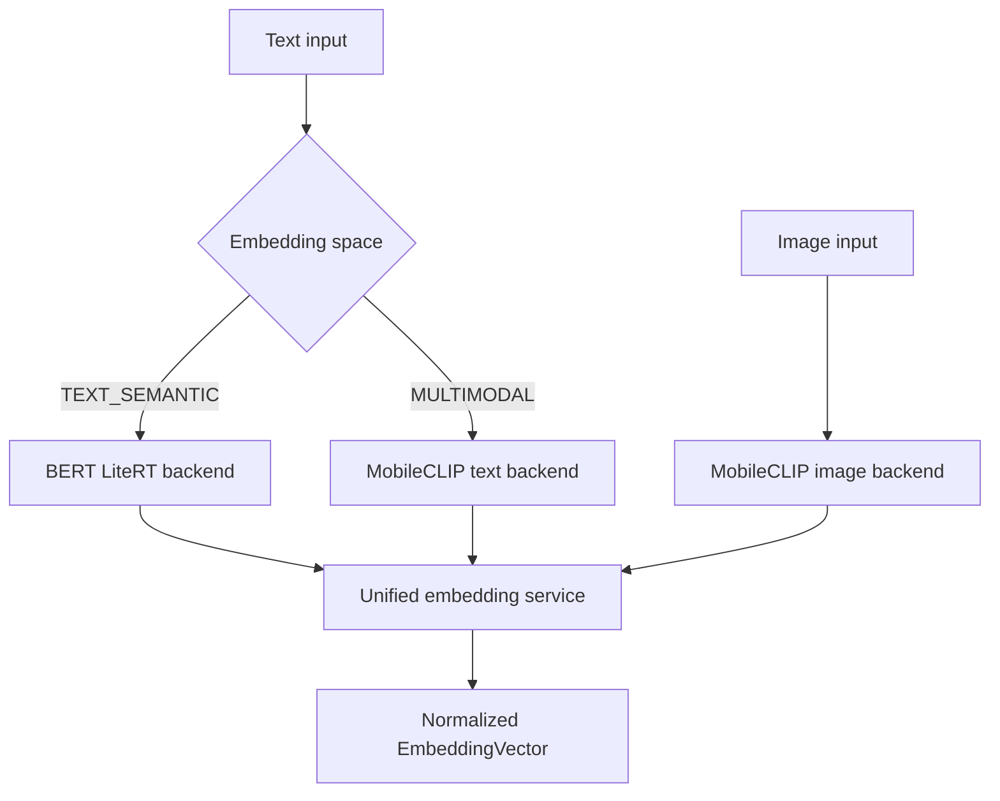

# Week 3 — Offline Embedding Engine

**Status:** Complete

**Completion date:** 2026-08-27

## Overview

Week 3 implements the local embedding foundation for the Offline Accessible Multimodal Local Content Retrieval System.

The embedding engine runs entirely on the local device using LiteRT models and supports two intentionally separate embedding spaces:

1. A BERT-based semantic space for text-to-text retrieval.
2. A MobileCLIP-S0 multimodal space for text-to-image and image-to-text retrieval.

The implementation includes:

- A shared embedding backend protocol.
- A unified embedding service.
- Text and image preprocessing.
- BERT WordPiece tokenization.
- MobileCLIP tokenization.
- Local LiteRT inference.
- L2 normalization.
- In-memory embedding caching.
- Typed embedding metadata.
- Explicit error handling.
- Unit tests and real-model runtime validation.

After model assets have been provisioned, no document, image, query, or embedding needs to be sent to an external inference service.

---

## Week 3 Objectives

The Week 3 implementation satisfies the following objectives:

- Generate semantic embeddings from local text.
- Generate aligned multimodal embeddings from local text and images.
- Execute inference locally with LiteRT.
- Keep semantic and multimodal vector spaces separate.
- Return consistently typed normalized vectors.
- Reject invalid inputs and incompatible model configurations.
- Avoid committing large model assets to Git.
- Verify converted MobileCLIP models against their PyTorch reference outputs.
- Maintain at least 85% test coverage for the embedding package.

---

## Scope

### Included

- BERT text embedding backend.
- MobileCLIP-S0 text embedding backend.
- MobileCLIP-S0 image embedding backend.
- BERT WordPiece tokenization.
- MobileCLIP tokenization.
- Text padding and attention-mask generation.
- Image loading, resizing, normalization, and channel ordering.
- LiteRT tensor-contract validation.
- Batch handling.
- L2 normalization.
- In-memory caching.
- Unified routing by modality and embedding space.
- Unit tests and real-model smoke tests.
- Local model-asset verification.

### Not Included

The following features are intentionally deferred:

- ChromaDB indexing.
- Persistent vector storage.
- Document chunk retrieval.
- Search ranking APIs.
- Flutter search integration.
- Dataset-scale NQ or COCO retrieval evaluation.
- Model quantization.
- Mobile-device latency benchmarking.
- Production model download and update workflows.

These features belong to Week 4 or later stages.

---

## Architecture



The two embedding spaces are deliberately independent. A BERT vector must never be directly compared with a MobileCLIP vector.

---

## Embedding Spaces

| Embedding space | Input modalities | Model | Dimension | Intended use |
| --- | --- | --- | ---: | --- |
| `TEXT_SEMANTIC` | Text | BERT-compatible LiteRT embedder | 512 | Text-to-text semantic retrieval |
| `MULTIMODAL` | Text and image | MobileCLIP-S0 | 512 | Text-to-image and image-to-text retrieval |

Although both spaces currently produce 512-dimensional vectors, their values are not interchangeable.

Vector dimension alone does not determine compatibility. The embedding space and model identifier must also match.

---

## Unified Embedding Types

The embedding package defines two supported modalities:

```python
class EmbeddingModality(str, Enum):
    TEXT = "text"
    IMAGE = "image"
```

It also defines two supported embedding spaces:

```python
class EmbeddingSpace(str, Enum):
    TEXT_SEMANTIC = "text_semantic"
    MULTIMODAL = "multimodal"
```

The unified service returns immutable `EmbeddingVector` values containing:

- `content_id`
- `values`
- `modality`
- `space`
- `model_id`

This metadata prevents downstream retrieval code from silently comparing vectors generated by incompatible models.

---

## Backend Routing

The service routes requests according to both modality and embedding space.

| Request | Selected backend |
| --- | --- |
| Text with `TEXT_SEMANTIC` | `BertLiteRTBackend` |
| Text with `MULTIMODAL` | `MobileClipTextBackend` |
| Image with `MULTIMODAL` | `MobileClipImageBackend` |
| Image with `TEXT_SEMANTIC` | Rejected as unsupported |

Text semantic retrieval defaults to the BERT embedding space.

Multimodal text queries must explicitly use `MULTIMODAL` so their vectors can be compared with MobileCLIP image embeddings.

---

# BERT Text Embedding

## Purpose

The BERT backend provides local semantic embeddings for text-to-text retrieval.

Potential uses include:

- Document chunk retrieval.
- Note search.
- Semantic metadata search.
- Matching user questions with local textual content.

## Model Identity

```text
Model ID: bert_embedder_float32_v1
Modality: text
Embedding space: text_semantic
Output dimension: 512
Output dtype: float32
```

## Tokenization

The BERT tokenizer uses a WordPiece vocabulary loaded through `BertWordPieceTokenizer`.

Tokenization behavior includes:

- Lowercase normalization.
- WordPiece segmentation.
- BERT special tokens.
- Maximum sequence length of 128 tokens.
- Truncation for long inputs.
- Preservation of the final separator token.
- Padding with token ID `0`.

## BERT Input Tensors

| Tensor name | Shape signature | Dtype | Meaning |
| --- | --- | --- | --- |
| `input_word_ids` | `[-1, 128]` | `int32` | WordPiece token IDs |
| `input_mask` | `[-1, 128]` | `int32` | Attention mask |
| `input_type_ids` | `[-1, 128]` | `int32` | Segment IDs |

The backend supports dynamic batch sizes by resizing the LiteRT input tensors before inference.

## BERT Output Tensor

| Tensor name | Shape signature | Dtype |
| --- | --- | --- |
| `module_apply_tokens/bert/pooler/Squeeze` | `[-1, 512]` | `float32` |

The backend validates the complete model signature during initialization. An incompatible model raises `EmbeddingConfigurationError`.

---

# MobileCLIP-S0 Multimodal Embedding

## Purpose

MobileCLIP-S0 provides a shared vector space for text and images.

This enables:

- Text-to-image retrieval.
- Image-to-image retrieval.
- Image-to-text retrieval when text was embedded with the MobileCLIP text encoder.
- Cross-modal similarity comparisons.

The MobileCLIP text and image encoders originate from the same official checkpoint and therefore share the same embedding space.

## Model Identity

```text
Model ID: mobileclip_s0
Embedding space: multimodal
Output dimension: 512
Output dtype: float32
```

## Model Source

The MobileCLIP-S0 checkpoint was obtained from Apple’s official MobileCLIP project:

- Repository: https://github.com/apple/ml-mobileclip
- Checkpoint: https://docs-assets.developer.apple.com/ml-research/datasets/mobileclip/mobileclip_s0.pt

The original PyTorch checkpoint was converted in Google Colab into two separate LiteRT models:

- `mobileclip_s0_text.tflite`
- `mobileclip_s0_image.tflite`

The tokenizer was exported separately as:

- `mobileclip_s0_tokenizer.json`

Conversion-only packages such as PyTorch, `litert-torch`, and the MobileCLIP repository are not required by the runtime application.

---

## MobileCLIP Reparameterization

The official MobileCLIP model factory already returned a reparameterized model in the conversion environment.

Calling `reparameterize_model()` a second time caused:

```text
AttributeError: 'RepMixer' object has no attribute 'mixer'
```

Inspection confirmed:

```text
RepMixer count: 20
Already reparameterized: True
```

The conversion therefore used the model returned by the official factory without applying a second reparameterization pass.

---

## MobileCLIP Tokenizer

The runtime tokenizer is loaded from the exported tokenizer JSON file.

Verified tokenizer properties:

```text
Start-of-text token ID: 49406
End-of-text token ID: 49407
Vocabulary size: 49408
Maximum sequence length: 77
```

Tokenizer behavior includes:

- Loading the tokenizer entirely from a local JSON asset.
- Rejecting missing or invalid tokenizer files.
- Rejecting blank input.
- Truncating sequences to 77 tokens.
- Preserving the end-of-text token after truncation.
- Normalizing tokenizer failures into embedding-specific exceptions.

Seven tokenizer parity and failure-path tests passed.

---

## MobileCLIP Text Tensor Contract

### Inputs

| Tensor | Shape | Dtype | Meaning |
| --- | --- | --- | --- |
| Token IDs | `[1, 77]` | `int32` | MobileCLIP token sequence |
| End-of-text position | `[1]` | `int32` | Position used to select the final text representation |

### Output

| Tensor | Shape | Dtype |
| --- | --- | --- |
| Text embedding | `[1, 512]` | `float32` |

The exported model has a fixed batch size of one. The backend supports multiple strings by invoking the interpreter once per input and stacking the resulting vectors.

---

## MobileCLIP Image Preprocessing

Images are prepared using the following steps:

1. Resolve and validate the local file path.
2. Open the image with Pillow.
3. Convert the image to RGB.
4. Resize and center-crop it to `256 × 256`.
5. Use bilinear interpolation.
6. Convert pixel values to `float32`.
7. Scale pixel values to `[0.0, 1.0]`.
8. Convert the layout from HWC to CHW.
9. Add the batch dimension before LiteRT inference.

The resulting model input shape is:

```text
[1, 3, 256, 256]
```

## MobileCLIP Image Tensor Contract

### Input

| Tensor | Shape | Dtype |
| --- | --- | --- |
| Image tensor | `[1, 3, 256, 256]` | `float32` |

### Output

| Tensor | Shape | Dtype |
| --- | --- | --- |
| Image embedding | `[1, 512]` | `float32` |

The image model also has a fixed batch size of one. Multiple image paths are processed sequentially and returned as a stacked array.

---

# Normalization

All raw model vectors are normalized centrally by the unified embedding service.

For a vector \(x\), L2 normalization is:

\[
\hat{x} = \frac{x}{\lVert x \rVert_2}
\]

After normalization:

\[
\lVert \hat{x} \rVert_2 \approx 1
\]

Normalization is intentionally not duplicated inside individual model backends.

Keeping normalization at the service layer ensures consistent behavior across BERT, MobileCLIP text, and MobileCLIP image inference.

Invalid vectors are rejected, including vectors containing:

- `NaN`
- Positive or negative infinity
- Invalid dimensions
- Zero norm
- Unexpected batch shapes

---

# Embedding Cache

The embedding service includes an in-memory cache for repeated requests.

The cache prevents unnecessary local inference when the same content is requested again with the same model context.

Cache behavior is covered by dedicated tests, including:

- Cache hits.
- Cache misses.
- Cache insertion.
- Cache eviction.
- Separation between incompatible model or embedding-space requests.

The current cache is process-local and does not replace persistent vector storage.

Persistent storage and ChromaDB integration are deferred to Week 4.

---

# Error Handling

Expected embedding failures use the following exception hierarchy:

| Exception | Purpose |
| --- | --- |
| `EmbeddingError` | Base class for expected embedding failures |
| `InvalidEmbeddingInputError` | Invalid text, image path, modality, or request input |
| `InvalidEmbeddingVectorError` | Invalid model output or normalization result |
| `EmbeddingBackendError` | LiteRT inference failure |
| `EmbeddingConfigurationError` | Missing assets or incompatible model configuration |

Low-level LiteRT, Pillow, tokenizer, and file-loading exceptions are normalized into these application-specific errors.

This prevents model-specific implementation details from leaking into future API handlers.

---

# Implementation Files

## Runtime Package

| File | Responsibility |
| --- | --- |
| `backend/app/services/embeddings/__init__.py` | Embedding package initialization |
| `backend/app/services/embeddings/base.py` | Shared backend protocol and input type |
| `backend/app/services/embeddings/types.py` | Modalities, embedding spaces, and result type |
| `backend/app/services/embeddings/errors.py` | Embedding exception hierarchy |
| `backend/app/services/embeddings/text_preprocessor.py` | Token padding, masks, and segment tensors |
| `backend/app/services/embeddings/image_preprocessor.py` | Local image preprocessing |
| `backend/app/services/embeddings/normalization.py` | Vector validation and L2 normalization |
| `backend/app/services/embeddings/cache.py` | In-memory embedding cache |
| `backend/app/services/embeddings/service.py` | Unified routing, normalization, and caching |
| `backend/app/services/embeddings/bert_tokenizer.py` | BERT WordPiece tokenizer |
| `backend/app/services/embeddings/bert_backend.py` | BERT LiteRT backend |
| `backend/app/services/embeddings/mobileclip_tokenizer.py` | MobileCLIP tokenizer adapter |
| `backend/app/services/embeddings/mobileclip_backend.py` | MobileCLIP text and image LiteRT backends |

## Tests

| File | Responsibility |
| --- | --- |
| `backend/tests/test_embedding_cache.py` | Cache behavior |
| `backend/tests/test_embedding_normalization.py` | Vector validation and normalization |
| `backend/tests/test_embedding_service.py` | Routing and unified service behavior |
| `backend/tests/test_text_preprocessor.py` | Text tensor preparation |
| `backend/tests/test_image_preprocessor.py` | Image preprocessing |
| `backend/tests/test_bert_tokenizer.py` | BERT tokenization |
| `backend/tests/test_bert_backend.py` | BERT LiteRT tensor contract |
| `backend/tests/test_mobileclip_tokenizer.py` | MobileCLIP tokenization and failure paths |
| `backend/tests/test_mobileclip_backend.py` | MobileCLIP text and image backends |

---

# Runtime Dependencies

The runtime embedding implementation uses:

```text
ai-edge-litert==2.2.0
tokenizers==0.23.1
pillow==12.3.0
numpy
```

Exact dependency versions are recorded in:

```text
backend/requirements.lock
```

The runtime lock file does not include conversion-only dependencies such as:

- `torch`
- `torchvision`
- `litert-torch`
- `transformers`
- MobileCLIP source packages

Those dependencies were only required in the isolated Google Colab conversion environment.

---

# Local Model Assets

The following assets are required locally:

| Asset | Approximate size | Purpose |
| --- | ---: | --- |
| `models/bert_text_embedder.tflite` | 25 MB | BERT semantic text encoder |
| `models/bert_vocab.txt` | 226 KB | BERT WordPiece vocabulary |
| `models/mobileclip_s0_image.tflite` | 43 MB | MobileCLIP image encoder |
| `models/mobileclip_s0_text.tflite` | 162 MB | MobileCLIP text encoder |
| `models/mobileclip_s0_tokenizer.json` | 3.5 MB | MobileCLIP tokenizer |

The complete float32 asset set is approximately 234 MB.

These assets are stored locally and are not committed to Git.

## Git Ignore Rules

The project `.gitignore` includes:

```gitignore
models/*.tflite
models/*.txt
models/mobileclip_s0_tokenizer.json
```

---

# Model Asset Checksums

Checksums identify the exact local assets used during Week 3 validation.

| Asset | SHA-256 |
| --- | --- |
| `bert_text_embedder.tflite` | `02ae6279faf86c2cd4ff18f61876c878bcc0b572b472f0678897a184c4ac7ef6` |
| `bert_vocab.txt` | `07eced375cec144d27c900241f3e339478dec958f92fddbc551f295c992038a3` |
| `mobileclip_s0_image.tflite` | `7c8bcc0c4687bcf9aac2ec02baf9e0b7556775e1ec7f9e1779b2dd29d5f035dd` |
| `mobileclip_s0_text.tflite` | `79f3a1079e001f66e66ba74da7cd7f1af0ebc8f301ec55bddcc9ad8123f93030` |
| `mobileclip_s0_tokenizer.json` | `6d9109cc838977f3ca94a379eec36aecc7c807e1785cd729660ca2fc0171fb35` |

A checksum mismatch means the local asset differs from the artifact used for the recorded validation.

---

# MobileCLIP Conversion Validation

The converted MobileCLIP models were compared directly with the PyTorch reference outputs generated from the official checkpoint.

## Reference Inference

Verified reference shapes:

```text
Image input:        (1, 3, 256, 256)
Text input:         (3, 77)
Raw image features: (1, 512)
Raw text features:  (3, 512)
Feature dtype:      torch.float32
Finite values:      True
```

A qualitative reference-image test produced:

```text
Best label: a diagram
```

This qualitative test confirms the paired encoders remained functionally aligned after model loading and preprocessing.

It does not replace a dataset-scale retrieval benchmark.

## Image Encoder Parity

```text
LiteRT output shape:    (1, 512)
LiteRT output dtype:    float32
Finite values:          True
Maximum absolute error: 9.96515154838562e-07
Cosine similarity:      1.0
All-close comparison:   True
```

## Text Encoder Parity

```text
LiteRT output shape:    (1, 512)
LiteRT output dtype:    float32
Finite values:          True
Maximum absolute error: 4.76837158203125e-06
Cosine similarity:      1.0
All-close comparison:   True
```

Both LiteRT exports reproduce their PyTorch reference outputs within small floating-point tolerances.

---

# Local Runtime Validation

## BERT Runtime

The real BERT LiteRT model was loaded on macOS and used to embed multiple strings.

Recorded result:

```text
Shape: (2, 512)
Dtype: float32
Finite: True
Different: True
Text semantic space: True
```

This verifies:

- Successful local model loading.
- Dynamic batch resizing.
- Correct output dimension.
- Correct output dtype.
- Finite output values.
- Different inputs producing different vectors.
- Correct assignment to `TEXT_SEMANTIC`.

## MobileCLIP Runtime

The real MobileCLIP text and image models were loaded on macOS.

Recorded result:

```text
Text shape: (2, 512)
Image shape: (1, 512)
Text dtype: float32
Image dtype: float32
Text finite: True
Image finite: True
Same embedding space: True
Text vectors differ: True
```

This verifies:

- Successful loading of both converted models.
- Correct text and image dimensions.
- Correct float32 output types.
- Finite text and image values.
- Shared `MULTIMODAL` metadata.
- Different text inputs producing different embeddings.

---

# Test Results

## MobileCLIP Tokenizer

```text
7 passed
100% coverage
```

## MobileCLIP Backends

```text
8 passed
100% coverage
```

## BERT Tokenizer and Backend

```text
7 passed
86% combined coverage
```

The BERT backend’s remaining uncovered lines are defensive configuration and failure paths. Successful real-model loading and inference were separately verified with the local smoke test.

## Complete Backend Regression Suite

```text
77 passed in 0.87s
Required test coverage of 85% reached
Total embedding coverage: 96.19%
```

## Coverage Summary

| Component | Coverage |
| --- | ---: |
| BERT tokenizer | 100% |
| BERT backend | 83% |
| Combined BERT focused coverage | 86% |
| MobileCLIP tokenizer | 100% |
| MobileCLIP backend | 100% |
| Complete embedding package | 96.19% |
| Required package coverage | 85% |

Coverage is enforced for the embedding package as a whole. Individual files are not required to independently exceed the package-level threshold.

---

# Verification Commands

Run the following commands from the repository root with the virtual environment active.

## Syntax Validation

```bash
python -m compileall -q \
  backend/app/services/embeddings \
  backend/tests
```

## Ruff Validation

```bash
python -m ruff check \
  backend/app/services/embeddings \
  backend/tests
```

## Full Test Suite

```bash
PYTHONPATH=backend python -m pytest \
  backend/tests \
  -v \
  --cov=app.services.embeddings \
  --cov-report=term-missing \
  --cov-fail-under=85
```

## Model Asset Verification

```bash
ls -lh \
  models/bert_text_embedder.tflite \
  models/bert_vocab.txt \
  models/mobileclip_s0_image.tflite \
  models/mobileclip_s0_text.tflite \
  models/mobileclip_s0_tokenizer.json
```

## Checksum Verification

```bash
shasum -a 256 \
  models/bert_text_embedder.tflite \
  models/bert_vocab.txt \
  models/mobileclip_s0_image.tflite \
  models/mobileclip_s0_text.tflite \
  models/mobileclip_s0_tokenizer.json
```

## Git Ignore Verification

```bash
git check-ignore -v \
  models/bert_text_embedder.tflite \
  models/bert_vocab.txt \
  models/mobileclip_s0_image.tflite \
  models/mobileclip_s0_text.tflite \
  models/mobileclip_s0_tokenizer.json
```

## Diff Validation

```bash
git diff --check
```

---

# Privacy and Offline Behavior

After the model assets have been provisioned, embedding generation requires no network access.

Local processing includes:

- Reading text from application memory.
- Reading images from local file paths.
- Tokenization.
- Image preprocessing.
- LiteRT inference.
- Vector normalization.
- In-memory caching.

The implementation does not upload user documents, images, queries, or embeddings to a cloud inference provider.

Large model assets are excluded from Git to avoid repository bloat and accidental redistribution.

---

# Known Limitations

## Fixed MobileCLIP Batch Size

The exported MobileCLIP LiteRT models accept a batch size of one.

The runtime backends support multiple inputs by invoking the interpreter sequentially and stacking the results. This is correct but may be slower than dynamically batched inference.

## Float32 Model Size

All current models use float32 inference.

The complete model-asset set is approximately 234 MB. Quantization may reduce disk and memory usage but must be validated against retrieval quality before adoption.

## Manual Asset Provisioning

Model assets must currently be copied into the local `models/` directory manually.

Automated downloads, checksum enforcement, version manifests, and model-update workflows are deferred.

## No Dataset-Scale Accuracy Benchmark

The implementation includes:

- Tokenizer tests.
- PyTorch-to-LiteRT numerical parity.
- Real local runtime smoke tests.
- A qualitative cross-modal example.
- Unit and integration-style tests.

It does not yet include a full Natural Questions, MS COCO, or similar dataset-scale retrieval evaluation.

No dataset-level accuracy claim is made in Week 3.

## Incompatible Embedding Spaces

BERT and MobileCLIP vectors must not be compared directly, even though both are 512-dimensional.

Downstream indexing must preserve:

- `model_id`
- `space`
- `modality`
- Vector dimension

Retrieval must filter or route by embedding space before similarity comparison.

## Performance Benchmarking Deferred

Desktop CPU inference is functional, but the following have not yet been systematically measured:

- Cold-start latency.
- Warm inference latency.
- Peak memory usage.
- Multi-worker behavior.
- Mobile-device latency.
- Battery impact.

---

# Completion Criteria

Week 3 is considered complete because:

- [x] BERT text tokenization works locally.
- [x] BERT LiteRT inference returns 512-dimensional vectors.
- [x] MobileCLIP tokenization matches the expected token contract.
- [x] MobileCLIP text inference returns 512-dimensional vectors.
- [x] MobileCLIP image inference returns 512-dimensional vectors.
- [x] MobileCLIP text and image outputs share the same embedding space.
- [x] BERT and MobileCLIP spaces remain separate.
- [x] Text preprocessing generates token IDs, masks, and type IDs.
- [x] Image preprocessing produces the expected NCHW float32 input.
- [x] Embeddings are validated and L2-normalized.
- [x] Repeated requests can use the embedding cache.
- [x] Expected failures use application-specific exceptions.
- [x] Real model smoke tests pass on macOS.
- [x] PyTorch-to-LiteRT MobileCLIP parity passes.
- [x] All 77 backend tests pass.
- [x] Embedding package coverage exceeds 85%.
- [x] Model assets are excluded from Git.
- [x] Runtime dependencies exclude conversion-only packages.

---

# Next Steps

Week 4 should build persistent indexing and retrieval on top of the completed embedding engine.

Recommended Week 4 work:

1. Define the persistent vector-record schema.
2. Connect the embedding service to ChromaDB.
3. Store model ID, embedding space, modality, and content metadata with every vector.
4. Route text-to-text queries through `TEXT_SEMANTIC`.
5. Route cross-modal queries through `MULTIMODAL`.
6. Prevent similarity comparisons across incompatible spaces.
7. Index ingested document chunks.
8. Index supported local images.
9. Implement top-k semantic retrieval.
10. Handle duplicate indexing and content updates.
11. Add retrieval-quality fixtures.
12. Expose retrieval through backend service interfaces.
13. Add API endpoints after the retrieval boundary is stable.
14. Measure latency and memory usage with realistic local content.

Week 4 must reuse the existing embedding service rather than invoking LiteRT interpreters directly from storage, API, or retrieval code.