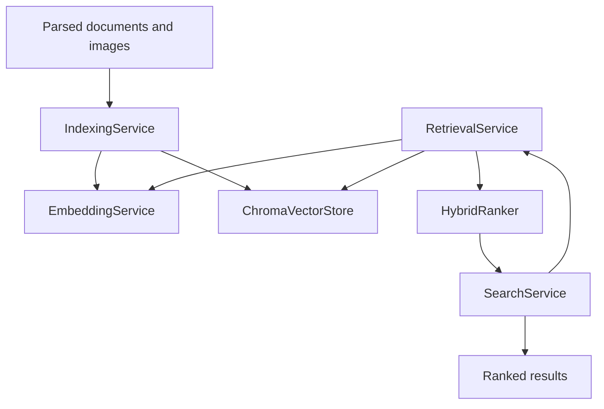

# Week 4 — Persistent Retrieval and Hybrid Ranking

**Status:** Complete

## Overview

Week 4 connects the Week 2 ingestion foundation and Week 3 offline embedding engine to persistent local retrieval.

The implementation stores BERT and MobileCLIP vectors in ChromaDB, keeps incompatible embedding spaces isolated, retrieves text and image candidates through separate channels, and applies deterministic hybrid ranking with explainable component scores.

The complete retrieval path remains local:

```text
Parsed documents and local images
    → Offline embedding service
    → Persistent ChromaDB collections
    → Three-channel candidate retrieval
    → Explainable hybrid ranking
    → Ranked local results
```

## Week 4 Objectives

The Week 4 objectives were to:

- Persist local embedding vectors with ChromaDB.
- Keep text-semantic and multimodal vectors isolated.
- Index parsed documents in both required embedding spaces.
- Index local images in the MobileCLIP multimodal space.
- Retrieve text and image candidates from compatible models only.
- Combine keyword and semantic evidence through explainable ranking.
- Preserve deterministic ordering for equal scores.
- Verify persistence and the complete retrieval flow.
- Maintain at least 85% retrieval-package test coverage.

## Scope

### Included

- Persistent ChromaDB vector storage.
- Cosine-distance vector collections.
- Vector upsert, query, update, and deletion.
- Embedding-space, model, and modality isolation.
- Parsed-document indexing.
- Local-image indexing.
- Content-based image deduplication.
- BERT text-semantic candidate retrieval.
- MobileCLIP multimodal text retrieval.
- MobileCLIP text-to-image retrieval.
- Keyword-overlap scoring.
- Explainable hybrid ranking.
- Deterministic tie-breaking.
- Search-service orchestration.
- Unit, persistence, and end-to-end integration tests.

### Not Included

- FastAPI indexing and search endpoints.
- Flutter search-screen integration.
- DOCX parsing.
- OCR for screenshots or scanned PDFs.
- Dataset-scale retrieval-quality benchmarking.
- Production tuning of hybrid-ranking weights.
- Cross-platform packaging.

## Architecture



The services preserve separate responsibilities:

- `IndexingService` converts local content into vector records.
- `EmbeddingService` owns model routing, batching, caching, and normalization.
- `ChromaVectorStore` owns persistent vector storage and filtered vector queries.
- `RetrievalService` collects candidates from compatible vector channels.
- `HybridRanker` performs deterministic score calculation without I/O.
- `SearchService` composes retrieval and ranking into one application-facing operation.

# Retrieval Contracts

## VectorRecord

`VectorRecord` represents one record before it is written to ChromaDB.

It contains:

- A stable record ID.
- Searchable content.
- The resolved source path.
- The source SHA-256 value.
- The normalized `EmbeddingVector`.

Text records use:

```text
text:<document_id>
```

Image records use:

```text
image:<image_content_id>
```

The same text record ID can exist in the two separate ChromaDB collections because the vectors belong to different embedding spaces.

## RetrievalMatch

`RetrievalMatch` contains the stored content and the vector-query result:

- Record ID.
- Content.
- Source path.
- Source SHA-256.
- Embedding content ID.
- Modality.
- Embedding space.
- Model ID.
- Cosine distance.
- Cosine similarity.

Similarity is derived from cosine distance:

```text
similarity = 1 - distance
```

## RetrievalCandidates

Candidate results remain separated into three channels:

```text
text_semantic
multimodal_text
multimodal_images
```

This prevents vectors from being mixed merely because they have the same dimensionality.

## RankedResult

Each final ranked result exposes:

- Keyword score.
- BERT text-semantic score.
- MobileCLIP multimodal score.
- Final combined score.
- Source path and SHA-256.
- Result modality.

These fields make the ranking behavior visible to future API and UI layers.

# Persistent ChromaDB Storage

## Collections

Two persistent collections are used:

| Collection | Embedding space | Stored modalities |
| --- | --- | --- |
| `text_semantic_vectors` | `TEXT_SEMANTIC` | Text |
| `multimodal_vectors` | `MULTIMODAL` | Text and image |

The collections use cosine distance because Week 3 returns L2-normalized vectors.

```text
configuration = {
    "hnsw": {
        "space": "cosine"
    }
}
```

The application provides all embeddings directly. ChromaDB does not download or run an external embedding function.

## Stored Metadata

Each ChromaDB record stores:

```text
content_id
source_path
source_sha256
modality
space
model_id
```

Queries filter by the query vector's `model_id` and optionally by modality.

This prevents:

- BERT vectors from being compared with MobileCLIP vectors.
- Text queries from accidentally returning an unintended modality.
- Records from incompatible model versions from being mixed.

## Upsert Behavior

The store uses `upsert`, so the same record ID in the same embedding space can be updated without creating a duplicate record.

A request containing duplicate IDs within the same space is rejected before writing because the intended update order would otherwise be ambiguous.

## Delete Behavior

Deletion requires both:

- The record IDs.
- The embedding space.

Deleting a record from one collection does not remove the record with the same ID from another collection.

## Persistence

`chromadb.PersistentClient` stores data under a local filesystem path.

The integration test creates a second `ChromaVectorStore` instance after indexing and confirms that the indexed records remain queryable.

# Indexing

## Document Indexing

Every parsed document is embedded twice:

```text
Document text
    → BERT
    → TEXT_SEMANTIC / TEXT

Document text
    → MobileCLIP text encoder
    → MULTIMODAL / TEXT
```

The resulting records share the same stable record ID:

```text
text:<document_id>
```

They are stored in separate collections.

This supports:

- BERT text-to-text retrieval.
- MobileCLIP multimodal text retrieval.
- Future comparison between text and image content in the same MobileCLIP space.

## Image Indexing

Every local image is embedded with the MobileCLIP image encoder:

```text
Local image
    → MobileCLIP image encoder
    → MULTIMODAL / IMAGE
```

The image content ID is based on SHA-256 file content and becomes part of its stable record ID:

```text
image:<content_sha256>
```

If multiple input paths contain identical image content, only the first record is written during that indexing request.

## Input Validation

Indexing rejects:

- Blank document IDs.
- Blank document text.
- Missing document SHA-256 values.
- Duplicate document IDs in one request.
- Unexpected embedding counts.
- Embeddings with the wrong modality or embedding space.

Embedding failures are normalized into retrieval-layer indexing errors.

# Candidate Retrieval

A text query is embedded in two spaces:

```text
Query
    → BERT text vector
    → TEXT_SEMANTIC

Query
    → MobileCLIP text vector
    → MULTIMODAL
```

The service then performs three isolated queries:

| Channel | Query space | Result modality |
| --- | --- | --- |
| Text semantic | `TEXT_SEMANTIC` | Text |
| Multimodal text | `MULTIMODAL` | Text |
| Multimodal image | `MULTIMODAL` | Image |

The same MobileCLIP query vector is used for multimodal text and image retrieval because both modalities were exported from the same MobileCLIP-S0 checkpoint.

The service rejects:

- Blank queries.
- Non-positive `top_k` values.
- Missing query vectors.
- Multiple query vectors for one query.
- Query vectors with incompatible spaces or modalities.

# Hybrid Ranking

## Keyword Score

Keyword scoring is case-insensitive and based on unique query-token overlap:

```text
keyword_score =
    matched_unique_query_tokens
    / total_unique_query_tokens
```

For example:

```text
Query:   local retrieval
Content: Local retrieval guide
Score:   2 / 2 = 1.0
```

Image results do not receive keyword scores because their stored content is a local path rather than extracted image text.

## Similarity Scores

Cosine similarity values are restricted to the `[0, 1]` range before ranking.

Missing evidence from a candidate channel receives a score of `0`.

For example, a document returned by BERT but not by MobileCLIP receives:

```text
multimodal_score = 0
```

The candidate remains eligible for ranking.

## Text Formula

The default text-ranking formula is:

```text
final_score =
    0.20 × keyword_score
  + 0.50 × text_semantic_score
  + 0.30 × multimodal_score
```

The default weights are an explicit engineering baseline. They have not yet been optimized against a dataset-scale relevance benchmark.

Weights must:

- Be finite.
- Be non-negative.
- Sum to `1.0`.

## Image Formula

Images currently have one valid ranking signal:

```text
final_score = multimodal_score
```

The image score is not multiplied by `0.30`. Applying the text multimodal weight directly would limit every image result to a maximum final score of `0.30`, making mixed text-and-image ranking structurally unfair.

## Candidate Merging

Text candidates from BERT and MobileCLIP are merged by `record_id`.

If the same record appears more than once within one channel, the occurrence with the highest similarity is preserved.

Image candidates remain independent from text candidates.

## Deterministic Ordering

Results are sorted by:

1. Final score descending.
2. Record ID ascending.

The record-ID tie-break prevents equal-score results from changing order between identical searches.

# Search Service

`SearchService` is the application-facing composition layer.

It performs:

```text
RetrievalService.retrieve()
    → RetrievalCandidates
    → HybridRanker.rank()
    → RankedResult list
```

It does not duplicate validation, model execution, ChromaDB access, or ranking calculations.

This thin composition layer can later be called by FastAPI without moving business logic into an HTTP handler.

# Error Handling

The retrieval package defines normalized errors for:

- Invalid retrieval inputs.
- Retrieval configuration failures.
- Vector-store failures.
- Indexing failures.
- Search failures.

Expected dependency failures are converted into retrieval-layer errors while preserving the original exception as the cause.

Empty upsert and delete operations are safe no-ops.

# Implementation Files

## Runtime Package

```text
backend/app/services/retrieval/
├── __init__.py
├── base.py
├── chroma_store.py
├── errors.py
├── hybrid_ranker.py
├── indexing_service.py
├── retrieval_service.py
├── search_service.py
└── types.py
```

## Tests

```text
backend/tests/
├── test_chroma_store.py
├── test_hybrid_ranker.py
├── test_indexing_service.py
├── test_retrieval_integration.py
└── test_retrieval_service.py
```

# Verification Results

## Week 4 Test Suite

The Week 4 retrieval suite completed successfully:

```text
37 passed in 0.78s
```

Retrieval-package coverage:

```text
361 statements
30 missed
91.69% total coverage
```

The required threshold was 85%.

## Complete Backend Regression

The complete backend regression suite completed successfully:

```text
114 passed in 1.04s
```

Combined Week 3 embedding and Week 4 retrieval coverage:

```text
807 statements
47 missed
94.18% total coverage
```

This confirms that the Week 4 changes did not break the Week 1–3 backend tests.

## End-to-End Integration

The integration test verifies:

```text
ParsedDocument and image
    → deterministic test embeddings
    → IndexingService
    → persistent ChromaDB
    → new ChromaVectorStore instance
    → RetrievalService
    → HybridRanker
    → SearchService
    → ranked text and image results
```

The integration test uses deterministic local test vectors so it can run quickly without loading the large LiteRT model assets.

Real BERT and MobileCLIP model execution was validated separately during Week 3.

## Static Validation

The Week 4 changed-file scope passed Ruff:

```text
All checks passed!
```

Python compilation completed successfully for the backend application and tests.

`git diff --check` completed without whitespace errors.

# Verification Commands

## Week 4 Ruff

```bash
python -m ruff check \
  backend/app/services/retrieval \
  backend/tests/test_chroma_store.py \
  backend/tests/test_indexing_service.py \
  backend/tests/test_retrieval_service.py \
  backend/tests/test_hybrid_ranker.py \
  backend/tests/test_retrieval_integration.py
```

## Week 4 Tests and Coverage

```bash
PYTHONPATH=backend python -m pytest \
  backend/tests/test_chroma_store.py \
  backend/tests/test_indexing_service.py \
  backend/tests/test_retrieval_service.py \
  backend/tests/test_hybrid_ranker.py \
  backend/tests/test_retrieval_integration.py \
  -v \
  --cov=app.services.retrieval \
  --cov-report=term-missing \
  --cov-fail-under=85
```

## Complete Backend Regression

```bash
PYTHONPATH=backend python -m pytest \
  backend/tests \
  -v \
  --cov=app.services.embeddings \
  --cov=app.services.retrieval \
  --cov-report=term-missing \
  --cov-fail-under=85
```

## Diff Validation

```bash
git diff --check
```

# Privacy and Offline Behavior

The Week 4 retrieval path remains offline:

- ChromaDB uses a local persistent directory.
- Embeddings are supplied by local Week 3 LiteRT backends.
- Indexed content and metadata remain on the local device.
- Search queries are embedded locally.
- No remote embedding API is used.
- No cloud vector database is used.
- Runtime ChromaDB data remains excluded from Git.

# Known Limitations

## Baseline Ranking Weights

The hybrid weights are explicit defaults and have not yet been tuned with a labeled relevance dataset.

## Simple Keyword Tokenization

Keyword scoring uses a lightweight regular-expression tokenizer. Language-specific tokenization and advanced lexical ranking are deferred.

## Candidate Pool Size

`SearchService` currently requests `limit` candidates from each retrieval channel. A separately configurable reranking pool can be added after retrieval-quality evaluation.

## Backend-Only Integration

The retrieval engine is not yet exposed through FastAPI or connected to the Flutter interface.

## Deterministic Integration Embeddings

The automated end-to-end test uses deterministic local vectors. Real LiteRT model execution is covered by the Week 3 runtime validation.

## Deferred Formats

DOCX parsing and OCR-based extraction remain outside the current milestone.

# Completion Criteria

Week 4 is complete because the implementation now provides:

- Persistent local vector storage.
- Isolated text-semantic and multimodal collections.
- Model and modality filtering.
- Document and image indexing.
- BERT and MobileCLIP query routing.
- Text-to-image retrieval.
- Explainable hybrid ranking.
- Deterministic result ordering.
- Search-service composition.
- Persistent-store integration testing.
- More than 85% retrieval-package coverage.
- Passing Week 1–4 backend regression tests.
- Offline operation without model or database assets committed to Git.

# Next Steps

Week 5 will focus on the Flutter interface and accessibility integration:

- Expose the required local FastAPI operations.
- Connect folder selection and indexing controls.
- Add the search input and ranked-result presentation.
- Display text and image result types clearly.
- Show explainable score information where useful.
- Add indexing progress and recoverable error feedback.
- Implement keyboard navigation and visible focus behavior.
- Add semantic labels and screen-reader announcements.
- Begin WCAG 2.1 AA interface validation.